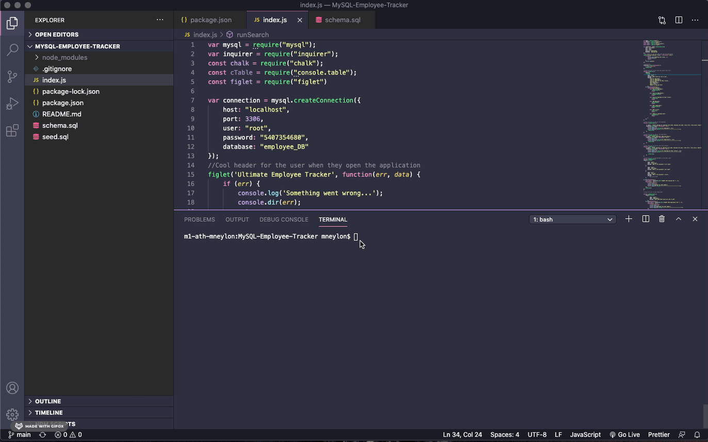
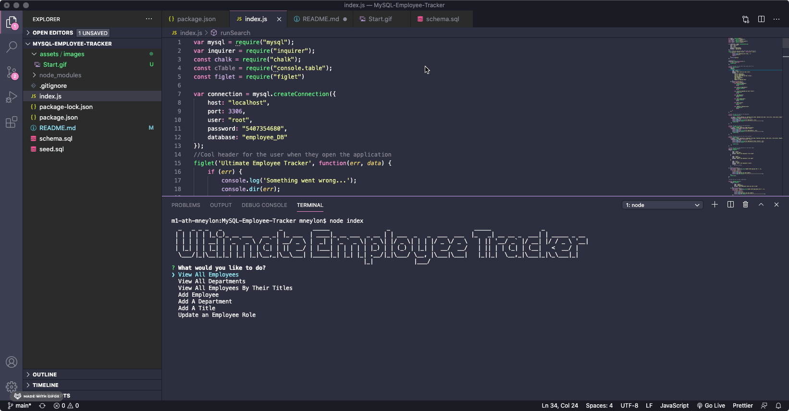
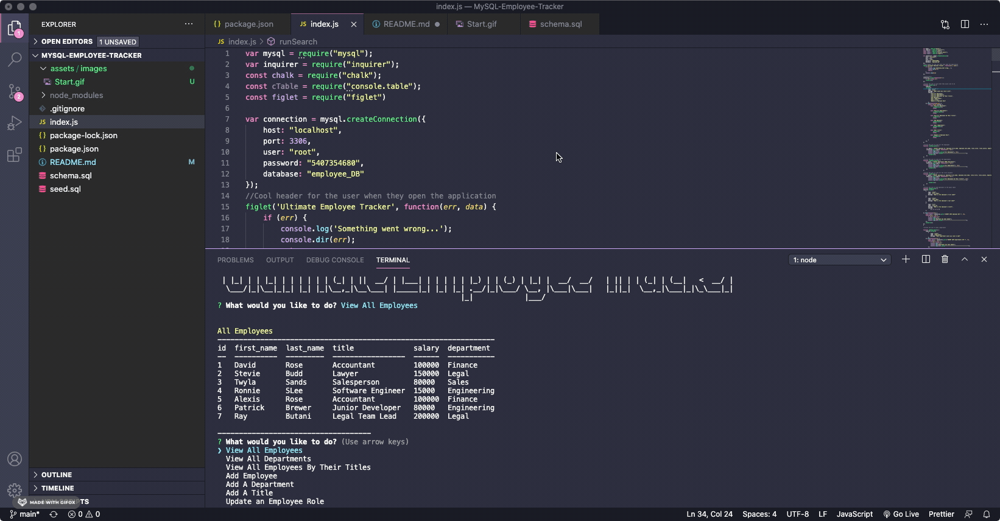
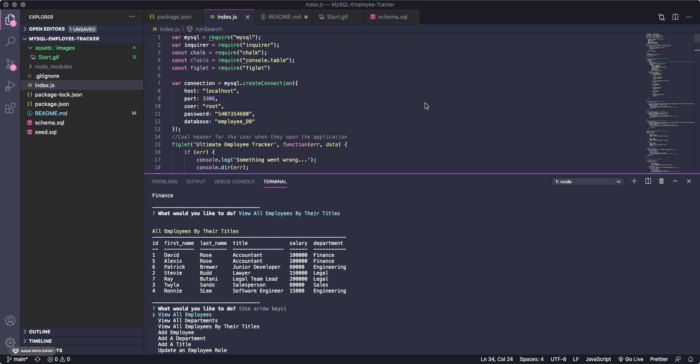
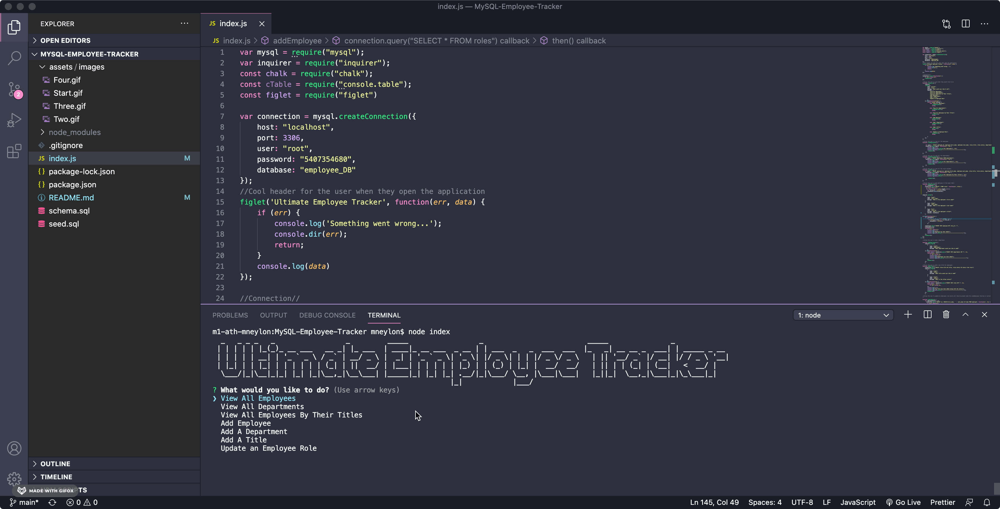
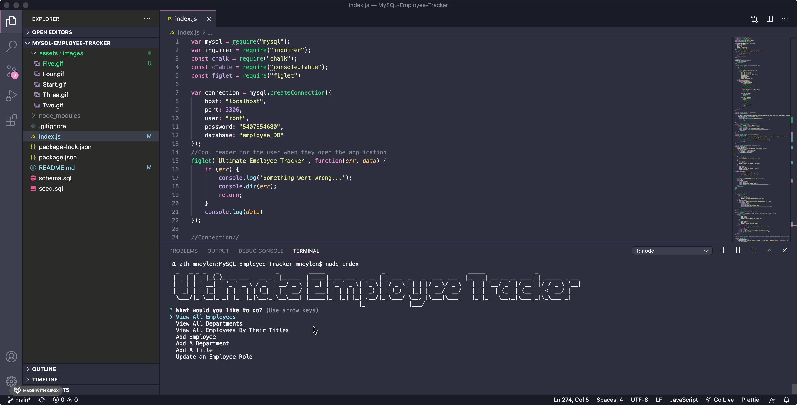

# Ultimate Employee Tracker

## Description
  This application is meant to help business owners be able to view and manage the departments, roles, and employees in their company so that they can organize and plan their business better.
## Table of Contents
  
* [Installation](#installation)
  
* [Usage](#usage)
  
* [License](#license)
  
* [Contributing](#contributing)
  
* [Tests](#tests)
  
* [Questions](#questions)

## Installation
  ```
  To start the application, the user will need to run node index.
  ```
  
## Usage
To start the application, the user will need to run node index which will deploy "Ultimate Employee Tracker" header and a list of questions asking the user what the would like to do next. 



If the user chooses either view all employees, departments or employees by their titles - they will be presented with a table with all the information they were looking for. 





If the user chooses add employee, department or title - they will be asked questions to gather information for whatever they would like to be added to the database. 



Users can also updated an employee and assign them a new role. 



To exit the application, the user simply types "control + c" . 


  
  
## License
  [](https://opensource.org/licenses/MIT)
  
## Contributing
  N/A
  
## Tests
  N/A
  
## Questions
Have questions? Feel free to contact me: 

  GitHub: [neylonmc]("https://github.com/neylonmc")
  Email: [neylonmc@gmail.com]("mailto:neylonmc@gmail.com") 